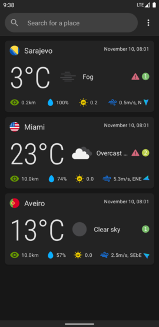
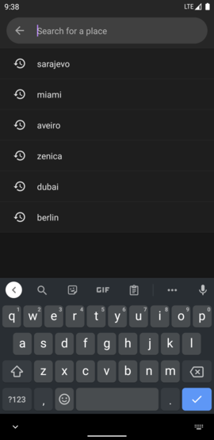
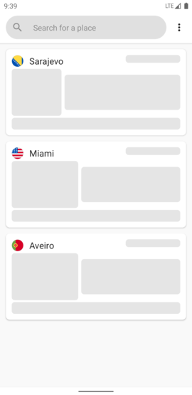
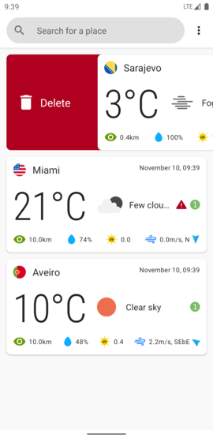
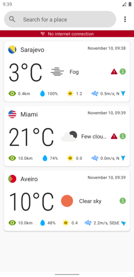
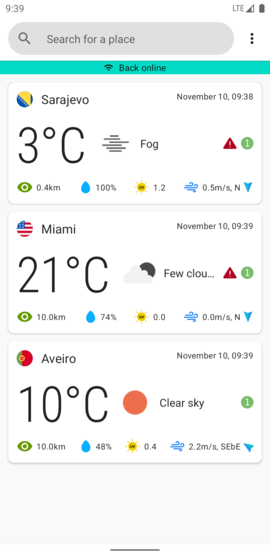
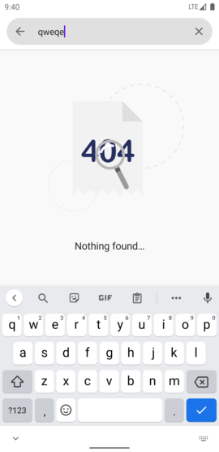

# A weather forecast app

A weather forecast app done using Android's new UI toolkit Jetpack Compose. This project utilizes the clean architecture approach with the MVVM architectural
pattern.

The app is in unfinished state. Things to be done:
* Detail screen
* Settings screen

In order to build the project you'll have to provide:
* **google-services.json** file to the *app* folder, or alternatively disable firebase features altogether by either deleting or commenting out the corresponding code
* api keys in the file *local.properties* as follows:
    * **LOCATION_IQ_API_KEY=***<location_iq_api_key>* (obtained at https://locationiq.com)
    * **OPEN_WEATHER_API_KEY=***<open_weather_api_key>* (obtained at https://openweathermap.org)

Libraries used: 
* Hilt
* Timber
* Firebase 
* Retrofit
* Moshi
* Room
* Accompanist
* Coil
* Lottie

Some screenshots:

